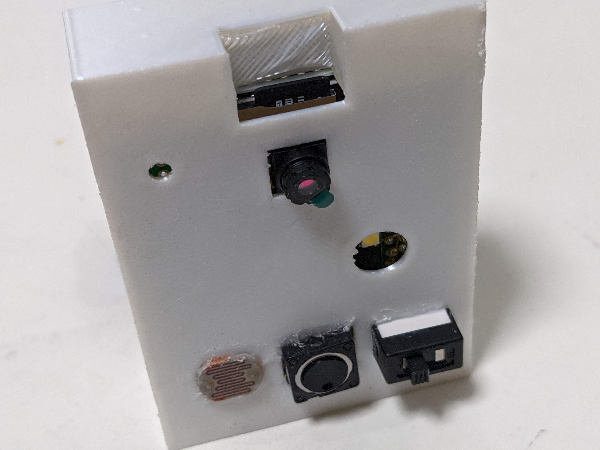
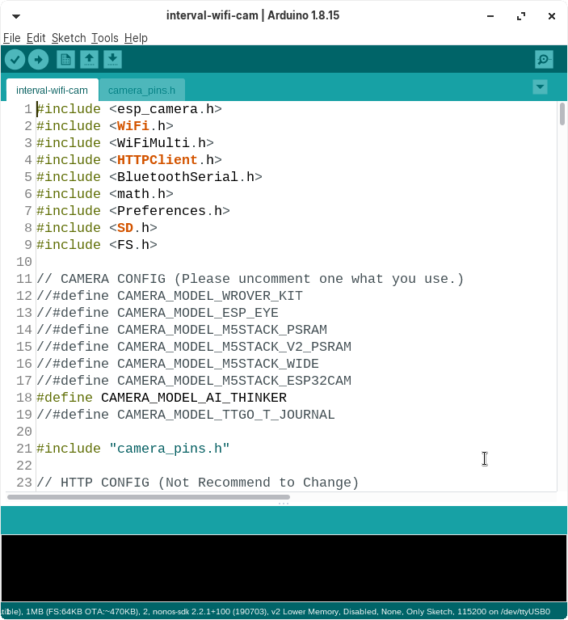
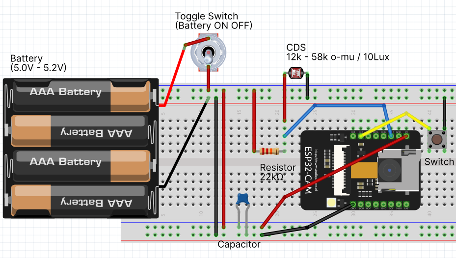
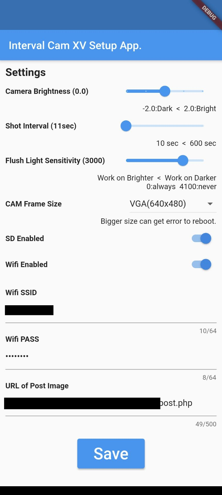

# interval-cam-xv とは
ESP32-CAMで作る、インターバルカメラです。SDカードやWifiを通してWebにアップロードします。 
 

#### 特徴
 - 一定間隔でカメラキャプチャします
 - Wifiを使ってWebにアップロードできます
 - SDカードに保存できます
 - 光センサで自動でフラッシュライトを点灯します
 - 設定用モバイルアプリがあります
 
 
 

# 実装
## 用意するもの
 - ESP32-CAM
 - SD Card (任意)
 - トグルスイッチ (ON/OFF用)
 - タクトボタン (設定モード用)
 - CdS光センサ (12k - 58k / 10luk)
 - 抵抗 (22kΩ)
 - キャパシタ
 - 5.0-5,2V バッテリ
 
 
 

## ESP32-CAM セットアップ
[esp32-code](https://github.com/koyaaaaaan/interval-cam-xv/tree/main/esp32-code) をArduinoIDEで開いて、ESP32にアップロードしてください。 
 

 
 
 

## 回路
下のように回路を実装してください。  

#### ESP32のつなぎ方

| Components                 | ESP32      |  
| -------------------------- | ---------- | 
| CdS光センサ         | IO12       | 
| タクトボタン                | IO2        | 
| バッテリーマイナス                | GND        | 
| バッテリープラス               | 5.0V       | 

#### 回路作成時の考慮点
- ESP32の光センサ部分は、0(0V) - 4095(5.0V)の値を返します。Cds光センサの性能に合わせて抵抗を調整してください。
- ESP32の多くの機能を使うため、バッテリが5.0Vを下回ると、電圧不足でESP32が再起動してしまいます。
- ESP32のIO0やIO16は使わないようにするのが無難です。フラッシュライト等が誤作動します。
 
 
 

## WebAPIの設置
[post.php](https://github.com/koyaaaaaan/interval-cam-xv/tree/main/web) をWebサーバーにアップロードしてください。ここにWifiアップロードしていきます。 
 
 
 

## 設定用モバイルアプリ 
現在、アプリをストアに申請中です...  
 

#### カスタムしたい場合
以下の方法で可能です。
1. [Android Studio](https://developer.android.com/studio)をダウンロードします。
2. flutter project`を作成します。
3. [flutter souce code](https://github.com/koyaaaaaan/interval-cam-xv/tree/main/interval_cam_xv) ここにあるファイルをあなたのプロジェクトにコピーします。
4. ビルドしてエラーが出たら直します。（Android SDKのバージョン等のエラーが出ると思います）

#### 使い方
1. カメラのタクトボタンを押しながらスイッチONします。フラッシュが３回転灯すれば設定モードになります。
2. 携帯とBluetoothペアリングしてください。
3. アプリを開いて接続します。設定画面が現れます。
4. 設定を変更してSAVEします。（少し時間がかかります）
5. 保存が終わったら、カメラの電源を切って再度ONにすれば反映されます。

| 設定名            | 説明                                                                        | 
| ----------------------- | ------------------------------------------------------------------------------- | 
| Camera Brightness       | カメラのBrightnessを調整します。画像が暗くなったり、明るくなったりします。          | 
| Shot Interval           | キャプチャの間隔です。（秒）                                             | 
| Flush Light Sensitivily | フラッシュライトを動かす明るさを設定します。 | 
| CAM Fram Size           | 画像のサイズです。大きすぎるとエラーすることがあります。                                         | 
| SD Enabled              | OnにするとSDカードに画像が保存されます。                                  | 
| Wifi Enabled            | OnにするとWifiを通じて画像がUploadされます。     | 
| Wifi SSID               | 接続するWifiのSSIDを入力します。     | 
| Wifi PASS               | 接続するWifiのパスワードを入力します。   | 
| URL of Post Image       | post.php のURLを入力します。       | 

