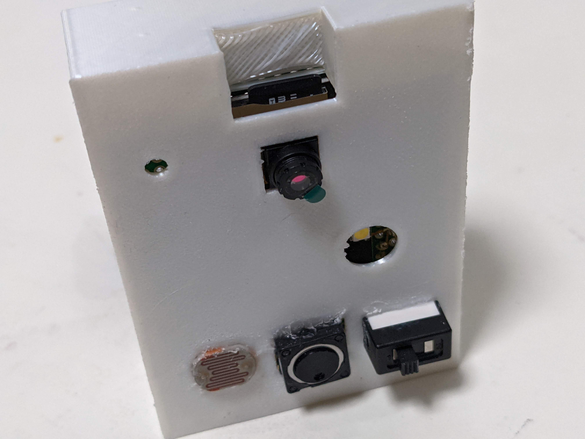
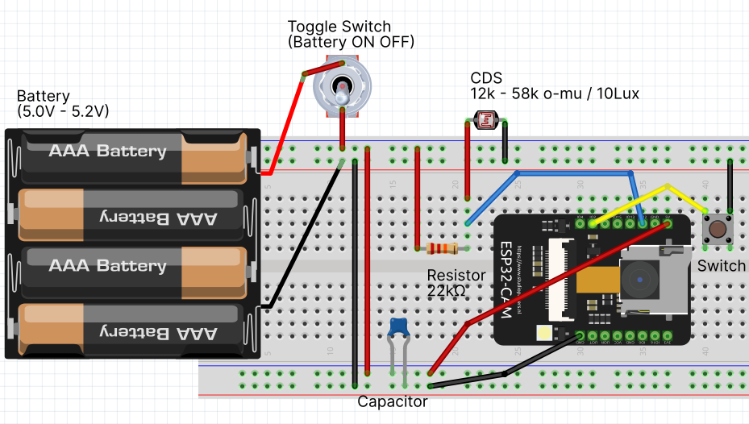

# interval-cam-xv
Interval Camera storing to SD and Web made out of ESP32 

#### Features
 - Interval Capture with front CAM
 - Upload image via Wifi
 - Store image in SD card
 - Automatic Flash with a brightness sensor (CDS)
 - Mobile setup App.
 
 
 

# Assebmle
## Components
 - ESP32-CAM
 - SD Card (optional)
 - Toggle Switch (ON/OFF)
 - Tact Button (Setting Mode)
 - CdS Photo Registor (12k - 58k / 10luk)
 - Resistor (22k o-mu)
 - Capacitor
 - 5.0-5,2V battery
 
 
 

## ESP32-CAM setup
Open "esp32-code" directory with ArduinoIDE to upload source code to ESP32-cam. 

 
 
 

## Electric Circuit
Assemble the circuit like below.  

#### ESP32 Pin connections

| Components   | ESP32      |  
| ------------ | ---------- | 
| CDS          | IO12       | 
| Tact Button  | IO2        | 
| Battery GND  | GND        | 
| Battery 5.0V | 5.0V       | 

#### Considering points
- The registor value is depends on your CDS. ESP32 Analog read returns 0(0V) - 4095(5.0V).
- This cam needs the voltage 5.0 above. Under 5.0 voltage supply can cause low energy error to restart ESP32.
- Don't recommend change the ESP32 pins. Because PIN0 / PIN16 can infect basic functions on ESP32.
 
 
 

## WebAPI Setup
Upload [post.php](https://github.com/koyaaaaaan/interval-cam-xv/tree/main/web) to your Web Server (need to setup php cgi runtime.) 
 
 
 

## Setting App. 
Now App. is issuing to App.Store...  
 

#### Customize your self
When you are iPhone user or wanna customize the App,  
you can make it with importing [flutter souce code](https://github.com/koyaaaaaan/interval-cam-xv/tree/main/interval_cam_xv) with [Android Studio](https://developer.android.com/studio)

#### How to use
1. Keep push down tact switch to turn on the CAM. 
   Interval CAM flush 3 times to get into Bluetooth setting mode. 
2. Pair Interval-Cam-XV with your phone.
3. Open App. to connect.
4. Change setting to Save it.
5. Reset Interval-CAM-XV.

#### Settings
| Setting Name            | Explains                                                                        | 
| ----------------------- | ------------------------------------------------------------------------------- | 
| Camera Brightness       | Bigger value makes the image more brighter.                                     | 
| Shot Interval           | Shot Interval set with second unit.                                             | 
| Flush Light Sensitivily | Criteria for flush light during capturing. It depends on your CDS and Resistor. | 
| CAM Fram Size           | Image size. Bigger size can get error.                                          | 
| SD Enabled              | When turn it on, the images will store in SD.                                   | 
| Wifi Enabled            | When turn it on, the images will upload via Wifi with following setting.        | 
| Wifi SSID               | Put your Wifi SSID.                                                             | 
| Wifi PASS               | Put your Wifi password.                                                         | 
| URL of Post Image       | Put full URL for post.php                                                       | 

